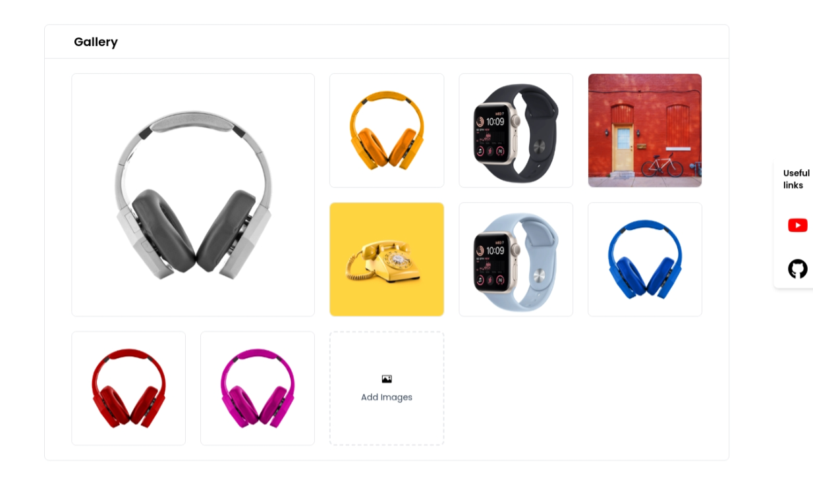
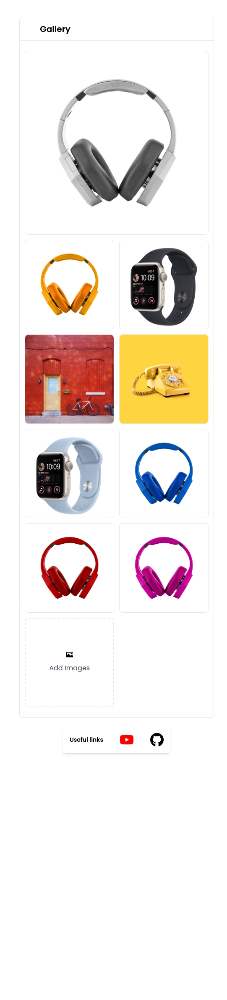
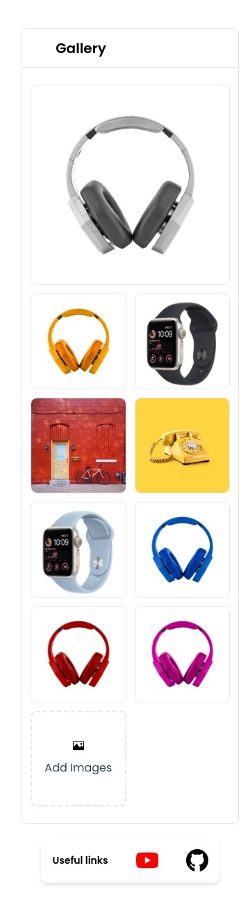

# Draggable Image Gallery

Welcome to the **Draggable Image Gallery**, an elegant, responsive, and sortable image gallery with a user-friendly interface. With this gallery, you have the flexibility to arrange your pictures exactly the way you want, whether you're on a desktop, tablet, or mobile device.

## Features

-   Drag and customize your image gallery as want.
-   Upload single or multiple picture on gallery.
-   Responsive in all devices.
-   Select the images
-   Delete the images.
-   Persist the customized gallery.

## Demo

You can experience the functionality of our Draggable Image Gallery by either visiting our [website](https://image-gallery-zxgc.vercel.app/) directly or by watching a demo video [here](https://www.loom.com/share/c3440dee956a4a17859061eb23f964b2).

#### in desktop mode



#### in tablet mode



#### in mobile device



## Installation

To get started with the Draggable Image Gallery on your local machine, follow these simple steps:

Clone this repo:

```bash
  git clone https://github.com/rijvimahmudd/-mage-gallery.git
  cd my-project
```

Install the required packages using npm:

```bash
  npm install
```

or if you prefer using pnpm:

```bash
  pnpm install
```

You can use any package manager of your choice.

Run the development server:

```bash
  pnpm run dev
```

## License

This project is licensed under the [MIT](https://choosealicense.com/licenses/mit/) License, giving you the freedom to use and modify it according to your needs.

Enjoy creating your personalized image gallery with the Draggable Image Gallery! If you have any questions or feedback, feel free to reach out.
